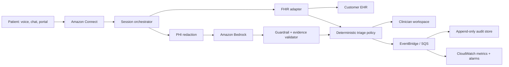

# System architecture

CareBridge separates probabilistic assistance from deterministic safety controls. A model may summarize and extract evidence, but it cannot lower urgency, dispatch care, write to an EHR, or close an interaction. Versioned policy code owns escalation; a workforce user owns the final action.



## Request path

1. Amazon Connect authenticates the workforce user and opens a scoped interaction session.
2. The orchestrator retrieves only the minimum EHR context required for the active workflow.
3. Direct identifiers are redacted before optional model inference; the mapping remains inside the session boundary.
4. The model returns a structured brief with evidence spans, never a free-form autonomous action.
5. The deterministic policy engine evaluates normalized facts and chooses the minimum allowed priority.
6. The workspace shows source, evidence, uncertainty, policy version, and required reviewer action.
7. A conditional write records the action once; an outbox event fans out audit, metrics, and downstream workflow.
8. Session-scoped PHI is discarded when the interaction ends; customer-controlled systems retain records under configured policy.

## Production AWS mapping

| Concern | AWS service | Key design choice |
|---|---|---|
| Omnichannel intake | Amazon Connect | Contact trace ID is the root correlation ID |
| Healthcare agent workflow | Amazon Connect Health | Session-scoped PHI and EHR integration |
| API edge | API Gateway + AWS WAF | JWT authorizer, schema limits, throttling |
| Orchestration | Lambda + Step Functions Express | Stateless handlers and bounded retries |
| Foundation model | Amazon Bedrock + Guardrails | Structured output, redacted input, evidence validation |
| Event backbone | EventBridge + SQS | At-least-once delivery, DLQs, consumer isolation |
| Operational state | DynamoDB | Conditional writes, TTL, point-in-time recovery, tenant key |
| Audit evidence | S3 Object Lock | Append-only, KMS encryption, lifecycle policy |
| EHR access | HealthLake/FHIR connector or private API | Per-tenant adapters, timeouts, circuit breaker |
| Observability | CloudWatch + X-Ray + CloudTrail | No PHI in logs; request IDs and policy versions only |
| Identity | IAM Identity Center + scoped IAM roles | Short-lived credentials and least privilege |

## Data contract

```json
{
  "schemaVersion": 1,
  "eventId": "uuid",
  "tenantId": "opaque-tenant-id",
  "interactionId": "opaque-contact-id",
  "occurredAt": "ISO-8601",
  "facts": { "symptoms": [], "measurements": [] },
  "policyVersion": "HF-DISCHARGE-v3",
  "idempotencyKey": "tenant#interaction#triage-v1"
}
```

No name, phone number, transcript, or raw MRN belongs in the event envelope. Consumers reject unknown major schema versions and tolerate additive optional fields.

## Scaling and consistency

- Partition operational records by `tenantId#interactionId`; use time-bucketed indexes for queue access to avoid hot tenants.
- Use conditional writes on the idempotency key, then publish through a transactional outbox.
- Scale consumers on queue age, not only depth. Reserve concurrency for safety escalation consumers.
- Apply exponential backoff with full jitter; do not retry validation or authorization failures.
- Place poison messages in a DLQ with correlation metadata and an operator-approved replay path.
- Treat EHR reads as bounded-staleness context. Revalidate immediately before a clinical write.

## Availability and degradation

The target is 99.95% monthly availability for the triage path and p95 under one second excluding EHR latency. If model inference is unavailable, deterministic rules and manual workflow remain available. If the EHR is unavailable, the UI labels context stale/unavailable and blocks high-risk writes. If event delivery is delayed, the durable state write succeeds and the outbox catches up.

## Key trade-offs

- DynamoDB favors predictable scale and conditional writes; ad-hoc clinical analytics belong in a de-identified lake.
- Asynchronous audit publication reduces foreground latency; an outbox prevents state/event dual-write loss.
- Session-scoped PHI lowers breach impact, but requires fresh EHR retrieval and explicit degraded-mode UX.
- Deterministic policy limits model autonomy, but produces testable and reviewable safety behavior.
